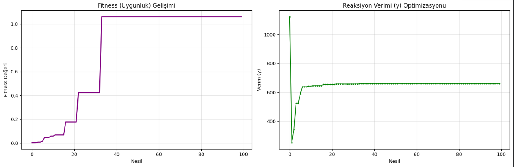

# Genetik Algoritma ile Kimya Tesisi Optimizasyonu (Senaryo 5)

Bu proje, **BLG-307 Yapay Zeka Sistemleri** dersi kapsamında, Genetik Algoritma (GA) kullanılarak kısıtlı bir optimizasyon problemini çözmek amacıyla geliştirilmiştir.

## 📖 Problemin Tanımı

[cite_start]Öğrenci numarasına göre seçilen bu senaryoda, bir kimyasal üretim tesisinde reaksiyon verimini etkileyen süre ve sıcaklık parametrelerinin optimize edilmesi hedeflenmiştir[cite: 96]. Amaç, belirli kısıtlar altında reaksiyon verimini maksimize etmektir.

### Matematiksel Model

**Amaç Fonksiyonu (Verim):**
[cite_start]$$y = 8x_1 + 3x_2 - x_1x_2 + x_1^2$$ [cite: 98]

**Değişkenler:**
* [cite_start]$x_1$: Reaksiyon Süresi (dk) $\rightarrow [10, 60]$ [cite: 101]
* [cite_start]$x_2$: Sıcaklık (°C) $\rightarrow [40, 120]$ [cite: 103]

**Kısıtlar:**
1. [cite_start]**Kaynak Kısıtı:** $x_1 + x_2 \le 140$ [cite: 106]
2. [cite_start]**Operasyonel Kısıt:** $x_2 \ge 60$ [cite: 107]

## ⚙️ Genetik Algoritma Bileşenleri

Çözümde, sürekli optimizasyon yapısına uygun olarak kısıtları Ceza Puanı (Penalty) yöntemiyle yöneten bir Genetik Algoritma (GA) kullanılmıştır.

* **Uygunluk (Fitness) Fonksiyonu:** Hata Minimizasyonu yaklaşımıyla (Hedef Verim - Gerçek Verim) + Kısıt İhlali Cezası şeklinde tasarlanmıştır.
* **Seçilim:** Rank (Sıralama) tabanlı seçim.
* **Çaprazlama:** Tek noktalı (Swap) çaprazlama.
* **Mutasyon:** Gaussian (Normal dağılım) mutasyonu, değişken sınırları içinde ince ayar için kullanılmıştır.

## 📊 Optimizasyon Sonuçları

Algoritma, 100 nesil sonunda geçerli bölgedeki en iyi çözüme yakınsamıştır.

| Parametre | Optimum Değer | Açıklama |
| :--- | :--- | :--- |
| **$x_1$ (Süre)** | 60.00 dk | Süre üst sınırında bulundu. |
| **$x_2$ (Sıcaklık)** | 60.02 °C | Sıcaklık alt sınırında ($x_2 \ge 60$) ve $x_1+x_2 \le 140$ kısıtını sağlayan bölgede bulundu. |
| **Maksimum Verim ($y$)** | **659.06** | Ulaşılan en yüksek verim puanı. |
| **Kısıt İhlali** | 0 | Çözüm, tüm kısıtları sağlamaktadır. |

### Gelişim Grafikleri

Nesiller boyunca Fitness değerinin (Uygunluk) ve Gerçek Reaksiyon Verimi ($y$) değerinin değişimi aşağıdadır. Verim, yaklaşık 40. nesilden sonra 659.06 değerine sabitlemiştir.

****

## 🚀 Kurulum ve Çalıştırma

Proje **Python 3** ortamında, Jupyter Notebook ile çalıştırılmak üzere hazırlanmıştır.

1.  **Repoyu klonlayın:**
    ```bash
    git clone [https://github.com/ulviyey/genetik_optimizasyonu_senaryo5.git](https://github.com/ulviyey/genetik_optimizasyonu_senaryo5.git)
    cd genetik_optimizasyonu_senaryo5
    ```

2.  **Gerekli kütüphaneleri yükleyin:**
    ```bash
    pip install -r requirements.txt
    ```

3.  **Notebook'u çalıştırın:**
    `senaryo5_cozumu.ipynb` dosyasını açarak tüm hücreleri çalıştırınız.

## 👤 Hazırlayan Bilgileri

* **Ad Soyad:** Ulviye Gülnihal Yüksel
* **Öğrenci No:** 2312721035
* **Ders:** BLG 307: Yapay Zeka Sistemleri
* **GitHub Repo Bağlantısı:** `https://github.com/ulviyey/genetik_optimizasyonu_senaryo5`
